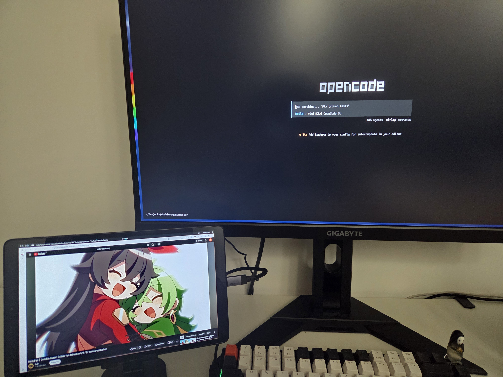

> ⚠️ **WARNING: VIBECODED PROJECT — USE AT YOUR OWN RISK**
>
> This project was generated by an AI coding assistant in a conversational, iterative manner ("vibecoding"). While it works, the code may contain rough edges, temporary fixes, or unconventional patterns. It has been tested on a specific setup (Arch Linux + Hyprland + AMD RX 7800 XT) and may require tweaks to work on yours. Do not run this on production systems or if you are not comfortable debugging low-level system interactions (uinput, VAAPI, ADB, etc.).
>
> 🚫 **DO NOT OPEN ISSUES OR ASK THE AUTHOR FOR SUPPORT**
>
> If it doesn't work on your setup, clone the repo and ask your AI agent to fix it for you. This repository is provided as-is with no support.

# Double Agent

Use your Android tablet as a true second monitor (with audio) for your Arch Linux PC running Hyprland, over USB.



## What You Get

- **True extended monitor**: Hyprland creates a virtual headless output. You can drag windows to it just like a real monitor.
- **Low-latency video**: H.264 hardware-encoded via AMD VAAPI, decoded on the tablet's hardware MediaCodec.
- **Audio forwarding**: PC desktop audio streams to the tablet speakers.
- **USB only**: Uses ADB reverse port forwarding. No WiFi needed.

## Project Structure

```
double-agent/
├── pc/                          # PC Server (Go)
│   ├── main.go                  # Entry point
│   ├── hyprland.go             # Headless output management
│   ├── capture.go              # Video/audio capture via wf-recorder/parec
│   ├── server.go               # TCP server
│   ├── protocol.go             # Message framing
│   ├── uinput.go               # Virtual touchscreen
│   └── go.mod
├── android/                     # Android Client (Kotlin)
│   └── app/src/main/java/com/doubleagent/
└── README.md
```

## Prerequisites

### PC (Arch Linux)
- Hyprland running
- `go` (compiler)
- `ffmpeg` (with VAAPI support)
- `libva-mesa-driver` (AMD VAAPI driver)
- `pipewire` + `pulseaudio-utils` (for `parec`)
- `wf-recorder` (Wayland screen capture)
- `android-tools` (ADB)
- Membership in the `input` group (for `/dev/uinput` access), **OR** run with `sudo`

### Android Tablet
- Android 9+ (API 28+)
- USB Debugging enabled in Developer Options
- Connected to PC via USB

### Build Tools
- Android SDK (for building the APK)
- JDK 17+ (for Gradle)

## Building

### 1. PC Server

```bash
cd pc
go build -o double-agent-pc .
```

### 2. Android Client

```bash
cd android
gradle assembleDebug
```

The APK will be at:
```
android/app/build/outputs/apk/debug/app-debug.apk
```

If you don't have Gradle in PATH, use the Gradle wrapper or your system's Gradle installation.

## Running

### Step 1: Connect tablet via USB

Enable **USB Debugging** on your Android tablet (Settings → System → Developer Options → USB Debugging).

Connect the tablet to your PC with a USB cable.

Verify ADB sees it:
```bash
adb devices
```

### Step 2: Install the Android app

```bash
adb install android/app/build/outputs/apk/debug/app-debug.apk
```

### Step 3: Run the PC server

```bash
cd pc
./double-agent-pc
```

You should see:
```
Double Agent - PC Server
Resolution: 1920x1200 @ 60 FPS
Listening on: :7777
Created headless output: HEADLESS-1
Server listening on :7777
Waiting for Android client to connect...
```

### Step 4: Launch the app on the tablet

Open the **Double Agent** app on your tablet.

Once connected, you'll see:
```
Client connected: /127.0.0.1:xxxxx
Client connected to PC
Streaming started
```

## Auto-start on Login (Optional)

To start the PC server automatically when you log in, create a systemd user service.

### 1. Create the service file

```bash
mkdir -p ~/.config/systemd/user
cat > ~/.config/systemd/user/double-agent.service << 'EOF'
[Unit]
Description=Double Agent - Android tablet second monitor
After=graphical-session.target

[Service]
Type=simple
Environment="HOME=%h"
ExecStartPre=-/bin/sh -c 'adb kill-server 2>/dev/null; sleep 1'
ExecStart=%h/Projects/double-agent/pc/double-agent-pc
WorkingDirectory=%h/Projects/double-agent/pc
Restart=on-failure
RestartSec=5
StartLimitInterval=60
StartLimitBurst=5
StandardOutput=journal
StandardError=journal

[Install]
WantedBy=default.target
EOF
```

### 2. Enable and start the service

```bash
systemctl --user daemon-reload
systemctl --user enable double-agent
systemctl --user start double-agent
```

### 3. Control the service

| Command | Action |
|---------|--------|
| `systemctl --user status double-agent` | Check status |
| `systemctl --user start double-agent` | Start now |
| `systemctl --user stop double-agent` | Stop now |
| `systemctl --user restart double-agent` | Restart |
| `systemctl --user disable double-agent` | Disable autostart |
| `journalctl --user -u double-agent -f` | Watch live logs |

## Usage

- **Drag windows to the tablet**: In Hyprland, the virtual monitor is positioned to the right of your main monitor. Drag windows there.
- **Audio**: Any audio playing on the PC will come out of the tablet speakers.
- **Stop**: Press `Ctrl+C` on the PC server. This cleans up the virtual monitor.

## Customization

Edit `pc/main.go` to change resolution, FPS, or port:

```go
width := 1920
height := 1200
fps := 60
addr := ":7777"
```

## Troubleshooting

### "failed to start wf-recorder"
Install wf-recorder via pacman:
```bash
sudo pacman -S wf-recorder
```

### "failed to start ffmpeg"
Ensure `ffmpeg` is built with VAAPI support:
```bash
ffmpeg -hwaccels | grep vaapi
```

If VAAPI doesn't work, the app will fall back to software encoding (high CPU usage). You can edit `capture.go` to change the encoder.

### "ADB reverse warning"
Make sure your tablet is connected and USB Debugging is enabled. Run `adb devices` to verify.

### "adb: device unauthorized"
When running as a systemd service, ADB may see a different environment and the tablet will show "Unauthorized". To fix:

1. Run `adb kill-server` and `adb devices` in your terminal
2. **Check your tablet screen** for the "Allow USB debugging?" dialog
3. Tap **"Always allow from this computer"** and OK
4. Restart the service: `systemctl --user restart double-agent`

### No video on tablet
- Check that the PC server is running and shows "Client connected".
- Check `adb logcat` on the PC for Android app errors.
- Some tablets have different MediaCodec capabilities. The decoder is configured for baseline H.264.

### Audio is choppy
Lower the audio latency in `capture.go` by adjusting `parec` parameters, or increase the audio buffer in `AudioPlayer.kt`.

## Architecture

```
PC (Hyprland)
  ├── hyprctl output create headless  (virtual monitor)
  ├── wf-recorder (VAAPI H.264 encode)
  ├── parec (PipeWire audio capture)
  └── TCP server (:7777)
            ↑↓  ADB reverse tcp:7777
Android Tablet
  ├── TCP client (localhost:7777)
  ├── MediaCodec (H.264 hardware decode)
  └── AudioTrack (PCM playback)
```

## License

MIT (do whatever you want)
